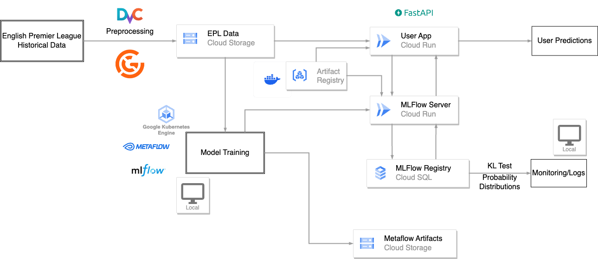

# MSDS 680 - MLOps Final Project

## Project Overview

This repository contains the code and infrastructure components for training, evaluating, and deploying a machine learning model to predict the outcomes of English Premier League (EPL) soccer matches. The project demonstrates the integration of various MLOps tools and practices, such as data versioning, model management, and orchestration using industry-standard technologies.

## Architecture


## Table of Contents
- [MSDS 680 - MLOps Final Project](#msds-680---mlops-final-project)
  - [Project Overview](#project-overview)
  - [Architecture](#architecture)
  - [Table of Contents](#table-of-contents)
  - [Purpose](#purpose)
  - [Setup and Installation](#setup-and-installation)
    - [Prerequisites](#prerequisites)
    - [Installation](#installation)
  - [Data Versioning with DVC](#data-versioning-with-dvc)
  - [Add a Dataset](#add-a-dataset)
  - [Create a Pipeline](#create-a-pipeline)
  - [Model Training and Inference](#model-training-and-inference)
    - [Training the Model](#training-the-model)
    - [Running Inference](#running-inference)
  - [Orchestration with Metaflow](#orchestration-with-metaflow)
  - [Running Tests with Great Expectations](#running-tests-with-great-expectations)
    - [Run a Great Expectations Test Suite](#run-a-great-expectations-test-suite)
  - [Model Tracking with MLFlow](#model-tracking-with-mlflow)
    - [Running MLFlow Tracking Server](#running-mlflow-tracking-server)
    - [Logging Models and Parameters](#logging-models-and-parameters)
  - [Deploying the App](#deploying-the-app)
    - [Building the Docker Image](#building-the-docker-image)
  - [Retrieving Predictions](#retrieving-predictions)
  - [Deploying on Google Cloud Run](#deploying-on-google-cloud-run)

## Purpose
The purpose of this project is to implement a full machine learning lifecycle using MLOps principles and best practices. This project specifically focuses on:

- Training a machine learning model to predict the outcomes of English Premier League (EPL) matches based on historical match data and team standings.
- Utilizing MLOps tools to streamline model development, versioning, deployment, and monitoring.
- Deploying a FastAPI application to serve the model and provide predictions.

The project utilizes the following MLOps practices and tools:

- **Data Versioning** using **DVC (Data Version Control)**.
- **Test Suites** for data validation and model quality assurance using **Great Expectations**.
- **Experiment Tracking** and **Model Management** using **MLFlow**.
- **Workflow Orchestration** and **Model Training** using **Metaflow** and **Kubernetes**.
- **Model Serving** and **API Deployment** using **FastAPI** and **Docker**.
- **Cloud Resources** using **GCP**.


## Setup and Installation

### Prerequisites
- Python 3.8 or later
- [Docker](https://www.docker.com/get-started) installed for containerized deployment
- [DVC](https://dvc.org/doc/install) for data versioning
- [Metaflow](https://docs.metaflow.org/metaflow/basics/installation) for workflow orchestration
- [MLFlow](https://mlflow.org/docs/latest/installation.html) for experiment tracking
- [Great Expectations](https://docs.greatexpectations.io/docs/) for data validation

### Installation
1. **Clone the repository**:
    ```bash
    git clone https://github.com/cwbennie/msds680-mlops-final-project.git
    cd msds680-mlops-final-project
    ```

2. **Install dependencies**:
    ```bash
    pip install -r requirements.txt
    ```

3. **Set up MLFlow**:
    Configure MLFlow's tracking server and storage, if applicable, using the environment variables.

## Data Versioning with DVC
Data Version Control (DVC) is used to manage the training and testing datasets. DVC tracks the data changes over time and ensures reproducibility.

- **Initialize DVC**:
  ```bash
  dvc init
  ```

## Add a Dataset

To add a dataset to your DVC pipeline:

```bash
dvc add data/final_dataset.csv
dvc add data/EPLStandings.csv
```

## Create a Pipeline

Configure pipelines using `dvc.yaml` and run the pipeline to reproduce data transformations and feature engineering.

## Model Training and Inference

Model training and inference are managed using **Metaflow**. Metaflow allows for local execution as well as deployment on Kubernetes for scalable workflows.

### Training the Model

To train the model locally:

```bash
python scripts/flows/epl_classifier_train.py run
```

To train the model on Kubernetes:

```bash
python scripts/flows/epl_kube_run.py --environment kubernetes run
```

### Running Inference

Inference can be run locally or on the cloud using Metaflow:

```bash
python scripts/flows/epl_predict.py run
```

## Orchestration with Metaflow

Metaflow is used to orchestrate model training and inference flows. Flows are defined using a series of steps that can run independently or in parallel.

- **Train Flow**: Located in `scripts/flows/epl_classifier_train.py`.
- **Inference Flow**: Located in `scripts/flows/epl_predict.py`.

## Running Tests with Great Expectations

Great Expectations is used to validate the data before training and ensure the quality of predictions.

### Run a Great Expectations Test Suite

To run a Great Expectations test suite:

```bash
great_expectations checkpoint run epl_training
```

## Model Tracking with MLFlow

MLFlow is used for tracking experiments, visualizing metrics, and managing model versions.

### Running MLFlow Tracking Server

To run MLFlow using local server:

```bash
mlflow server --backend-store-uri sqlite:///mlflow.db
```

### Logging Models and Parameters

Throughout the training process we can log models using `mlflow.sklearn`  or `mlflow.xgboost` APIs.

## Deploying the App

The **FastAPI** application located in the `app/` directory serves as a prediction API for the trained models.

### Building the Docker Image

NOTE: Before building the provided Docker image, you should change the epl_app.py to point towards your own MLFlow registry and server to get the model and provide inference.

To build and run the FastAPI app using Docker:

1. **Build the Docker image**:

    ```bash
    docker build -t epl-prediction-app .
    ```

2. **Run the container**:

    ```bash
    docker run -d -p 8000:8000 epl-prediction-app
    ```

3. Access the app at [http://localhost:8000](http://localhost:8000).

## Retrieving Predictions

To retrieve predictions from the model after building the FastAPI Docker image, use the following command:


```
curl -X 'POST' \
'http://0.0.0.0:8000/predict' \
-H 'accept: application/json' \
-H 'Content-Type: application/json' \
-d '{"teams": "Aresenal", "Chelsea"}'
```

## Deploying on Google Cloud Run

You can deploy the Docker container to **Google Cloud Run** for a fully managed serverless environment.